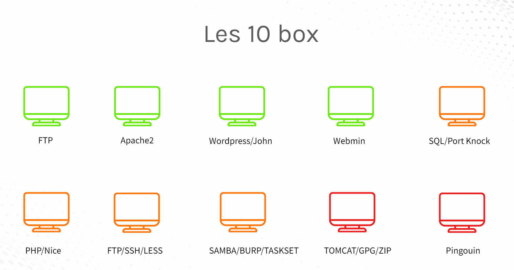
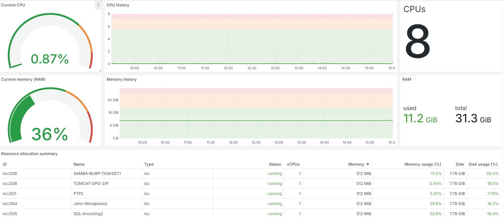

# AnsiBox

Our project involves the automatic deployment via Ansible of "boxes" on which blue teaming and red teaming can be performed. This project can be used as a crisis management exercise (e.g. DEFNET school exercise or Locked SHIELDS).

## The box
The image below represent the box present inside the infrastructure and their content :

## Organizational part

For the organizational part, the aim is for participants to organize themselves, elect a team leader and report back on their analyses.

## Supervision

The goal of the supervision is to watch the server, the box and the services running :

## How use the project ?

If you want to use the projet, follow this steps :

1. `git clone XXXXXX`

## Contact

* By mail : rettbl@protonmail.com
* By Discord : Rettbl#2970

This project was created for my last year of study.
